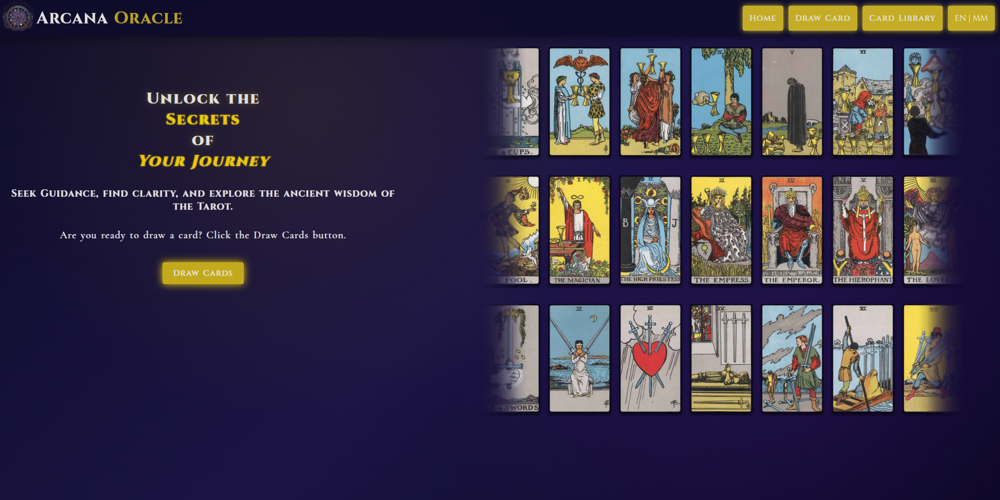
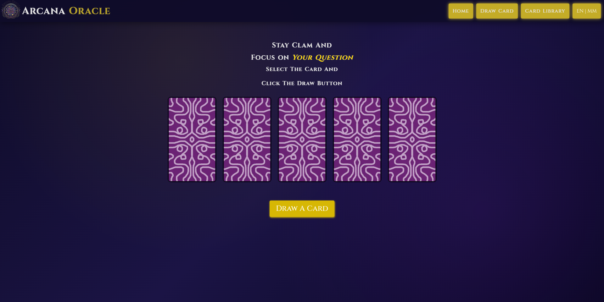
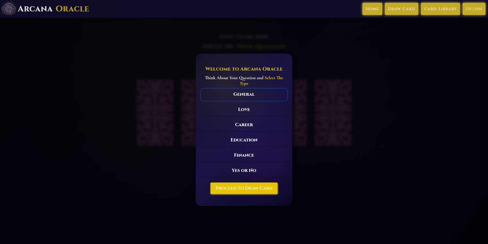

# 🔮 Tarot Card Website

A simple interactive tarot card web app where users can draw cards and view their meanings.

## 🌐 Live Demo

https://arcanaoracle.netlify.app/

## ✨ Features

* 🎴 Draw random tarot cards
* 🔄 Shuffle deck
* 🌐 Language toggle (English / Myanmar)
* 📖 Card detail modal (upright & reversed meanings)
* 📚 Card library page

## 🛠️ Technologies Used

* HTML
* CSS
* JavaScript

## 🚀 How to Use

### Draw Page

1. Select a card
2. Click "Draw"
3. View the result

### Library Page

1. Click a card
2. View upright meaning
3. Click again to see reversed meaning

## 📁 Project Structure

* index.html → Home page
* drawpage.html → Card drawing page
* cardlibrary.html → Card library page
* script.js → Main logic
* draw.js → Draw page logic
* library.js → Library page logic
* cards.js / lang.js → Data

## 📚 Documentation

- Card System → docs/card-system.md
- Language System → docs/language-system.md
- Draw Logic → docs/draw-logic.md

## 📸 Screenshots

### Home Page

### Draw Page

### Library Page

## 📌 Future Improvements

* Add animations
* Save history of draws

## 👤 Author

Toe Tet Aung Linn (Candy)
